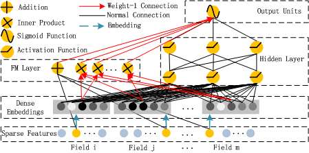
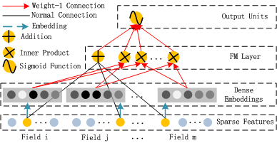
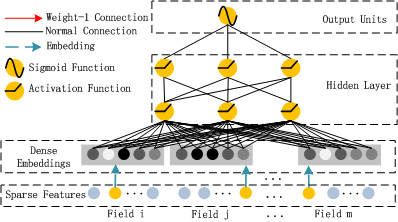

# Recommender_Systems

## 算法篇 Algorithm

### FM

推荐系统一般面临的问题是评分预测问题，给定用户集合 $U = {u_1, u_2, u_3,...u_M}$, 物品集合 $I = {i_1, i_2, i_3,.....i_N}$ ,模型是一个评分函数：
$f: \mathbb{U} \times \mathbb{I} \rightarrow \mathbb{R}$

$y = f(u, i)$ 表示用户$u$对物品$i$的评分。

其中已知部分用户在物品上的评分：$\mathbb{S} \in \mathbb{U} \times \mathbb{I}, \forall(u, i) \in \mathbb{S}, \tilde{y}=f(u, i)$，目标是求解剩余用户再剩余物品上的评分：$\hat{y}=f(u, i), \forall(u, i) \in \complement_{\mathbb{S}}$

其中 $\mathrm{C}_{\mathbb{S}}$ 为 $\mathbb{S}$ 的补集。

- 通常评分问题是一个回归问题，模型预测结果是评分的大小。此时损失函数采用 $MAE/MSE$ 等等。

- 也可以将其作为一个分类问题，模型预测结果是各评级的概率。此时损失函数是交叉熵。

- 当评分只有 0 和 1 时，这表示用户对商品 “喜欢/不喜欢”，或者 “点击/不点击”。这就是典型的点击率预估问题。

LR模型是简单的线性模型，原理简单，易于理解，训练非常方便，对于一般的分类或者预测问题，可以很容易的训练。但是，LR模型特征之间是彼此独立的，无法拟合特征之间的非线性关系，而现实生活中的特征之间往往不是独立的而是存在一定的内在联系。以新闻推荐为例，一般男性用户看军事新闻多，而女性用户喜欢情感类新闻，那么可以看出性别与新闻的类别有一定的关联性，如果能找出这类相关的特征，是非常有意义的，可以显著提升模型预测的准确度。

#### 一、LR模型

其中 $X$ 属于n维特征向量, 即 $X \in \mathbb{R}^{n}, y$ 属于目标值，回归问题中 $y \in \mathbb{R}$, 二分类问题中 $y \in\{-1,+1\}$

$\hat{y}(X)=w_{0}+\sum_{i=1}^{n} w_{i} x_{i}$

从LR模型可以看到：
>(1) 各个特征分量 $x_{i}$ 和 $x_{j}(i \neq j)$ 彼此之间是独立的
(2) $\hat{y}(X)$ 将单个特征分量线性的组合起来，却忽略了特征分量彼此之间的相互组合关系；

所以LR模型只考虑了一阶特征的线性组合关系

对于特征组合关系来说，我们定义如下：
>(1) 一阶特征：即单个特征，不产生新特征，如 $x_{1}$
(2) 二阶特征：即两个特征组合产生的新特征，如 $x_{1} x_{2}$
(3) 高阶特征：即两个以上的特征组合产生的新特征, 如 $x_{1} x_{2} x_{3}$

#### 二、多项式模型方程

为了克服模型二阶特征的组合因素，我们用LR模型改写为二阶多项式模型：

$\hat{y}(X)=w_{0}+\sum_{i=1}^{n} w_{i} x_{i}+\sum_{i=1}^{n-1} \sum_{j=i+1}^{n} w_{i j} x_{i} x_{j}$

其中 $x_{i} x_{j}$ 表示两个互异特征组合的二阶特征, $w_{i j}$ 表示二阶特征的交叉项系数
至此，该模型似乎已经加入了特征组合的因素，接下来只要学习参数即可

但是，上述二阶多项式模型却有一个致命的缺陷：
>数据稀疏性普遍存在的实际应用场景中，二阶特征系数 $w_{i j}$ 的训练是很困难的

造成的学习困难是因为：
>(1) $w_{i j}$ 的学习需要大量特征分量 $x_{i}$ 和 $x_{j}$ 都非零的样本
(2) 样本本身是稀流的，同时满足 $x_{i} x_{j} \neq 0$ 的样本非常稀少

所以多项式模型虽然加入了二阶特征组合，但是收到了数据稀疏的影响

#### 三、FM模型方程

为了克服模型无法在稀疏数据场景下学习二阶特征系数 $w_{i j}$, 我们需要将 $w_{i j}$ 表示为另外一种
形式
为此，针对样本 $X$ 的第维特征分量 $x_{i}$, 引入辅助隐向量 $v_{i}$
$$
v_{i}=\left(v_{i 1}, v_{i 2}, \ldots, v_{i k}\right)^{T} \in \mathbb{R}^{k}
$$

其中k是超参数，表示特征分量 $x_{i}$ 对应一个 $\mathrm{k}$ 维隐向量 $v_{i}$, 则将 $w_{i j}$ 表示为:
$$
w_{i j}=<v_{i}, v_{j}>=\sum_{f=1}^{k} v_{i f} v_{j f}
$$

上面引入隐向量的含义为：
>-阶特征系数 $w_{i j}$ 等价于：特征分量 $x_{i}$ 和 $x_{j}$ 对应的隐向量 $v_{i}$ 和 $v_{j}$ 的内积
$<v_{i}, v_{j}>$, 这就是FM模型的核心思想

#### 四、FM模型

我们将二阶多项式模型改写为FM模型
$$
\hat{y}(X)=w_{0}+\sum_{i=1}^{n} w_{i} x_{i}+\sum_{i=1}^{n-1} \sum_{j=i+1}^{n}<v_{i}, v_{j}>x_{i} x_{j}
$$

FM(Factorization machines, 因子分解机) 是点击率预估场景中最常见的算法模型，FM的参数为$w_{0} \in \mathbb{R}, w \in \mathbb{R}^{n}, V \in \mathbb{R}^{n \times k}$

各个参数的含义为：
>(1) $w_{0} \in \mathbb{R}$ 表示FM模型的偏置
(2) $w \in \mathbb{R}^{n}$ 表示FM模型对一阶特征的建模
(3) $V \in \mathbb{R}^{n \times k}$ 表示FM模型对二阶特征的建模

参数的个数为： $1+n+n k$
复杂度为： $O\left(n^{2} k\right)$

#### 五、FM具体求解

使用矩阵分解来做；
(1) 每个特征 $x_{i}$ 对应的隐向量 $v_{i}$ 组成的矩阵 $V$ :
$$
V=\left[\begin{array}{c}
v_{1}^{T} \\
v_{2}^{T} \\
\ldots \\
v_{n}^{T}
\end{array}\right]=\left[\begin{array}{cccc}
v_{11} & v_{12} & \ldots & v_{1 k} \\
v_{21} & v_{22} & \ldots & v_{2 k} \\
\ldots & \ldots & \ldots & \ldots \\
v_{n 1} & v_{n 2} & \ldots & v_{n k}
\end{array}\right]_{n \times k}
$$

即矩阵 $V$ 的第行表示：第维特征 $x_{i}$ 的隐向量 $v_{i}$

则矩阵 $V^{T}$ 为：
$$
V^{T}=\left[\begin{array}{llll}
v_{1} & v_{2} & \ldots & v_{n}
\end{array}\right]=\left[\begin{array}{cccc}
v_{11} & v_{21} & \ldots & v_{n 1} \\
v_{12} & v_{22} & \ldots & v_{n 2} \\
\ldots & \ldots & \ldots & \ldots \\
v_{1 k} & v_{2 k} & \ldots & v_{n k}
\end{array}\right]_{k \times n}
$$

(2) 多项式模型的二阶特征系数 $w_{i j}$ 组成的方阵 $W$
$$
W=\left[\begin{array}{cccc}
\mathbf{w}_{11} & w_{12} & \ldots & w_{1 n} \\
w_{21} & \mathbf{w}_{22} & \ldots & w_{2 n} \\
\ldots & \ldots & \ldots & \ldots \\
w_{n 1} & w_{n 2} & \ldots & \mathrm{w}_{\mathrm{nn}}
\end{array}\right]_{n \times n}
$$

(3) FM模型的二阶特征系数 $<v_{i}, v_{j}>$ 组成的方阵 $\widehat{W}$
$$
\begin{array}{c}
\hat{W}=V \times V^{T}=\left[\begin{array}{c}
v_{1}^{T} \\
v_{2}^{T} \\
\ldots \\
v_{n}^{T}
\end{array}\right] \times\left[\begin{array}{llll}
v_{1} & v_{2} & \ldots & v_{n}
\end{array}\right]=\left[\begin{array}{cccc}
\mathbf{v}_{1}^{\mathrm{T}} \mathbf{v}_{1} & v_{1}^{T} v_{2} & \ldots & v_{1}^{T} v_{n} \\
v_{2}^{T} v_{1} & \mathbf{v}_{2}^{\mathrm{T}} \mathbf{v}_{2} & \ldots & v_{2}^{T} v_{n} \\
\ldots & \ldots & \ldots & \ldots \\
v_{n}^{T} v_{1} & v_{n}^{T} v_{2} & \ldots & \mathbf{v}_{\mathbf{n}}^{\mathrm{T}} \mathbf{v}_{\mathbf{n}}
\end{array}\right]_{n \times n} \\
=\left[\begin{array}{cccc}
\mathbf{v}_{1}^{\mathrm{T}} \mathbf{v}_{1} & w_{12} & \ldots & w_{1 n} \\
w_{21}^{\hat{2}} & \mathbf{v}_{2}^{\mathrm{T}} \mathbf{v}_{2} & \ldots & w_{2 n} \\
\ldots & \ldots & \ldots & \ldots \\
w_{n 1} & w_{n 2} & \ldots & \mathbf{v}_{\mathbf{n}}^{\mathrm{T}} \mathbf{v}_{\mathrm{n}}
\end{array}\right]_{n \times n}
\end{array}
$$

从上面的三个矩阵中可以看到；
>(1) 方阵 $W$ 的非对角线上三角的元素, 即为多项式模型的二阶特征系数： $w_{i j}$
(2) 方阵 $\widehat{W}$ 的非对角线上三角的元素，即为FM模型的二阶特征系数 $:<v_{i}, v_{j}>$

由于 $\widehat{W}=V \times V^{T}$, 即隐向量矩阵的相乘结果，这是一种矩阵分解的方法,引用线性代数中的结论：

- 当k足够大时，对于任意对称正定的实矩阵 $\widehat{W} \in \mathbb{R}^{n \times n}$, 均存在实矩阵 $V \in \mathbb{R}^{\mathrm{n} \times \mathrm{k}}$,
使得 $\widehat{W}=V \times V^{T}$

所以FM模型需要保证 $\widehat{W}$ 的正定性。由于FM只关心互异特征之间的关系 $(i>j)$, 因此 $\widehat{W}$ 的对角线元素可以任意取值，只需将它们取足够大 (保证行元素严格对角占优），就可以保证
$\widehat{W}$ 的正定性

我们可以改写模型的二阶项系数项
$$
\begin{aligned}
& \sum_{i=1}^{n-1} \sum_{j=i+1}^{n}<v_{i}, v_{j}>x_{i} x_{j} \\
=& \frac{1}{2}\left(\sum_{i=1}^{n} \sum_{j=1}^{n}<v_{i}, v_{j}>x_{i} x_{j}-\sum_{i=1}^{n}<v_{i}, v_{i}>x_{i} x_{i}\right) \\
=& \frac{1}{2}\left(\sum_{i=1}^{n} \sum_{j=1}^{n} \sum_{f=1}^{k} v_{i f} v_{j f} x_{i} x_{j}-\sum_{i=1}^{n} \sum_{f=1}^{k} v_{i f}^{2} x_{i}^{2}\right) \\
=& \frac{1}{2} \sum_{f=1}^{k}\left[\sum_{i=1}^{n}\left(v_{i f} x_{i}\right) \sum_{j=1}^{n}\left(v_{j f} x_{j}\right)-\sum_{i=1}^{n} v_{i f}^{2} x_{i}^{2}\right] \\
=& \frac{1}{2} \sum_{f=1}^{k}\left[\left(\sum_{i=1}^{n}\left(v_{i f} x_{i}\right)\right)^{2}-\sum_{i=1}^{n} v_{i f}^{2} x_{i}^{2}\right]
\end{aligned}
$$

并对上面的过程做一个简化和解释：
>第1个等号：对称方阵 $\widehat{W}$ 的所有元素之和减去主对角线元素之和
第2个等号: $<v_{i}, v_{j}>$ 向量内积展开成累加形式
第3个等号: 提出公共部分 $\sum_{f=1}^{k}$
第4个等号：表示为"和平方"减去"平方和"

简化之后的表达式，FM模型方程为：

$\hat{y}(X)=w_{0}+\sum_{i=1}^{n} w_{i} x_{i}+\frac{1}{2} \sum_{f=1}^{k}\left[\left(\sum_{i=1}^{n}\left(v_{i f} x_{i}\right)\right)^{2}-\sum_{i=1}^{n} v_{i f}^{2} x_{i}^{2}\right]$

其中参数个数为： $1+n+k n$
模型的复杂度为： $O(k n)$
可以看到通过数学上的化简，FM模型的复杂度降低到了线性级别

#### 六、损失函数

利用FM模型方程，可以进行各种机器学习预测的任务，如回归、分类和排名等

对于回归问题，损失函数可以取最小平方误差函数

$$
\operatorname{loss}(\hat{y}, y)=\frac{1}{2}(\hat{y}-y)^{2}
$$

对于分类问题, 损失函数可以取logit逻辑函数
$$
\operatorname{loss}(\hat{y}, y)=\log \left(1+e^{-\hat{y} y}\right)
$$

#### 七、优化目标函数

最优化目标函数，即最优化模型方程的参数，即转化为下面最优化问题
$$
\theta^{*}=\operatorname{argmin} \sum_{i=1}^{N} \operatorname{loss}\left(\hat{y}_{i}, y_{i}\right)
$$

目标函数对模型参数的偏导数通式为：
$$
\frac{\partial}{\partial \theta} \operatorname{loss}\left(\hat{y}_{i}(\vec{X}), y_{i}\right)=\frac{\partial \operatorname{loss}\left(\hat{y}_{i}(\vec{X}), y_{i}\right)}{\partial \hat{y}_{i}(\vec{X})} \frac{\partial \hat{y}_{i}(\vec{X})}{\partial \theta}
$$

对于 $R^{2}$ 和或 $\log i t$ 作为损失函数而言， $\operatorname{los} s$ 对模型估计函数 $\hat{y}(X)$ 的偏导数为:
$$
\frac{\partial \operatorname{loss}\left(\hat{y}_{i}(\vec{X}), y_{i}\right)}{\partial \hat{y}_{i}(\vec{X})}=\left\{\begin{array}{ll}
\hat{y}_{i}-y_{i} & , \text { loss }=\frac{1}{2}\left(\hat{y}_{i}-y_{i}\right)^{2} \\
\frac{-y_{i}}{1+e^{j_{i} y_{i}}} & , \operatorname{loss}=\log \left(1+e^{-\hat{y}_{i} y_{i}}\right)
\end{array}\right.
$$

对于FM模型而言，优化的参数为： Tex parse error!，则FM模型方程对各个参数 $\theta^{*}$ 的偏
导数为：
$$
\frac{\partial \hat{y}_{i}(\vec{X})}{\partial \theta}=\left\{\begin{array}{cl}
1 & , \text { if } \theta=w_{0} \\
x_{i} & , \text { if } \theta=w_{i} \\
x_{i} \sum_{i=1}^{n}\left(v_{i f} x_{i}\right)-v_{i f} x_{i}^{2} & , \text { if } \theta=v_{i f}
\end{array}\right.
$$

#### 八、FM模型优势

最后我们总结出FM模型的优势:
>(1) FM模型对特征的一阶组合和二阶组合都进行了建模
(2) FM模型通过MF思想，基于K维的Latent Factor Vector, 处理因为数据稀疏带来
的学习不足问题
(3) FM模型的训练和预测的时间复杂度是线性的
(4) FM模型可以用于DNN的embedding

### DeepFM

线性模型由于无法引入高阶特征，所以FM模型应运而生，FM通过隐向量latent vector 做内积来表示特征组合，从理论上解决了低阶和高阶组合特征提取的问题，到那时一般受限于计算复杂度，也是只考虑2阶交叉特征。

随着DNN在图像、语音、NLP领域取得突破，人们意识到了DNN在特征的表示上有优势，提出CNN模型来做CTR预估。所以，使用DNN模型和FM联合训练，FM模型可以捕捉到低阶交叉特征，DNN模型可以捕捉到高阶特征，从而进行端到端的训练学习。

左边是FM模型，右边是Deep模型，在模型中，FM中的参数和Deep参数将共同参与训练，可以同时从原始特征中学习低阶特征交互和高阶特征交互，完全不需要执行特征工程。

假设输入包含 sparse 特征和 dense 特征。设输入向量 $\overrightarrow{\mathbf{x}}$, 其中:
$\overrightarrow{\mathbf{x}}=<\overrightarrow{\mathbf{x}}_{\text {sparse }}^{(1)}, \cdots, \overrightarrow{\mathbf{x}}_{\text {sparse }}^{(K)}, \overrightarrow{\mathbf{x}}_{\text {dense }}>\in \mathbb{R}^{d}$

其中 $\overrightarrow{\mathbf{x}}_{\text {sparse }}^{(i)}$ 为 $field_i$ 的 one-hot 向量, $\overrightarrow{\mathbf{x}}_{\text {dense }}$ 为原始的 dense 特征, $<$ ・$>$
为向量拼接。对于特征 $j$ (即$x_{j}$) :

- 标量 $w_{j}$ 用于对它的一阶特征重要性进行建模，即 $\mathrm{FM}$ 组件左侧的 $+$ 部分。

- 向量 $\overrightarrow{\mathbf{v}}_{j}$ 用于对它的二阶特征重要性进行建模，即 $\mathrm{FM}$ 组件右侧的 $\times$ 部分。

- 向量 $\overrightarrow{\mathbf{v}}_{j}$ 也作为 deep 组件的输入，从而对更高阶特征交互进行建模，即 deep 组件。
最终模型联合了 FM 组件和 Deep 组件的输出:

$\hat{y}=\operatorname{sigmoid}\left(\hat{y}_{F M}+\hat{y}_{D N N}\right)$

其中 $\hat{y} \in(0,1)$ 为模型预测的 $\mathrm{CTR}, \hat{y}_{F M}$ 为 FM 组件的输出, $\hat{y}_{DNN}$ 为 deep 组件的输出。

#### 一、FM 部分

FM部分主要用于一阶特征和二阶交叉特征，由两部分组成，分别是加法(Addition) 和内积(Inner Product)；

$\hat{y}_{F M}=\sum_{i=1}^{d}\left(w_{i} \times x_{i}\right)+\sum_{i=1}^{d} \sum_{i=j+1}^{d}\left(\overrightarrow{\mathbf{v}}_{i} \cdot \overrightarrow{\mathbf{v}}_{j}\right) \times x_{i} \times x_{j}$；

其中 $\overrightarrow{\mathbf{v}}_{i} \in \mathbb{R}^{k}$ 。

- 第一项 addition unit 用于一阶特征重要性建模
- 第二项 inner product 用于对二阶特征重要性建模

#### 二、Deep部分

Deep部分是一个前馈神经网络，用于学习高阶特征交互；

### 三、代码实现

#### Tensorflow

- DeepFM tensorflow 版本的代码实现存放在DeepFM_with_Tensorflow/ 目录

#### Pytorch

- DeepFM pytorch 版本的代码实现存放在 DeepFM_with_Pytorch/ 目录

## 工程篇 Engineering

本节主要介绍[TensorFlow Recommenders-Addons
](https://github.com/tensorflow/recommenders-addons/tree/6dced6c1fa5c3b35bcc735fb3544ac059acc1561)TFRA主要包括两个独立组件，tfra.dynamic_embedding 和 tfra.embedding_variableEmbeddingVariables组件。

主要量化dynamic_embedding 和 embedding之间性能提升区别；

##### 1、 tf 1.x 版本embedding

tf1.x版本的tf.nn.embedding_lookup 实验代码在目录Distrubution_recommender_sys/tf_nn_embedding.py中；
>在算法平台运行即可启动任务
%%model_training submit
-f tensorflow
--data_input=/dataset/example/
--parallel_mode=1
--work_dir=/privatecode/tensorflow24/
--pss=2
--ps_img=harbor.weizhipin.com/arsenal_notebook/tfra:0.0.1
--ps_cmd=python
--ps_args=tf_nn_embedding.py
--ps_cpu=4
--ps_memory=8Gi
--workers=2
--worker_img=harbor.weizhipin.com/arsenal_notebook/tfra:0.0.1
--worker_cmd=python
--worker_args=tfra-movielens-1m.py
--worker_cpu=2
--worker_memory=16Gi
--disable_data_save_mode
--disable_model_version
--pending_wait_time 2h

##### 2、tf 2.2.4版本embedding

tfra.dynamic_embedding 实验代码在Distrubution_recommender_sys/tfra_embedding.py中，
>运行下面命令即可执行
%%model_training submit
-f tensorflow
--data_input=/dataset/example/
--parallel_mode=1
--work_dir=/privatecode/tensorflow24/
--pss=2
--ps_img=harbor.weizhipin.com/arsenal_notebook/tfra:0.0.1
--ps_cmd=python
--ps_args=tfra-movielens-1m.py
--ps_cpu=4
--ps_memory=8Gi
--workers=2
--worker_img=harbor.weizhipin.com/arsenal_notebook/tfra:0.0.1
--worker_cmd=python
--worker_args=tfra-movielens-1m.py
--worker_cpu=2
--worker_memory=16Gi
--disable_data_save_mode
--disable_model_version
--pending_wait_time 2h

##### 3、实验结果

本次实验其他变量保持一直，包括$batch size, epoch, dataset,embedding size$，
实验所用数据为MovieLens；

- 100多万条电影评分
- 3900部电影
- 6000多名用户

实验结果tfra运行速度要略快于tf nn_embedding
>(total cost) tfra_dynamic 1257.9s
>(total cost) tf_nn_embedding 1336.99s

## 参考(Reference)

本实验和算法参考以下博客，部分文献收录于Reference目录中：

<https://www.cnblogs.com/Matrix_Yao/p/4773221.html>
<https://github.com/guestwalk/libffm>
<http://www.cs.cmu.edu/~wcohen/10-605/2015-guest-lecture/FM.pdf>
<https://tech.meituan.com/2016/03/03/deep-understanding-of-ffm-principles-and-practices.html>
<https://mp.weixin.qq.com/s/LKIuLYz8fP3BL3cB1CsHlw#at>
<https://discuss.tf.wiki/t/topic/1482>
<https://github.com/tensorflow/recommenders-addons/tree/6dced6c1fa5c3b35bcc735fb3544ac059acc1561>
<https://blog.csdn.net/GFDGFHSDS/article/details/104782245>

感谢博哥，翰晨、李瑞等同事的帮助完成实验部分。
